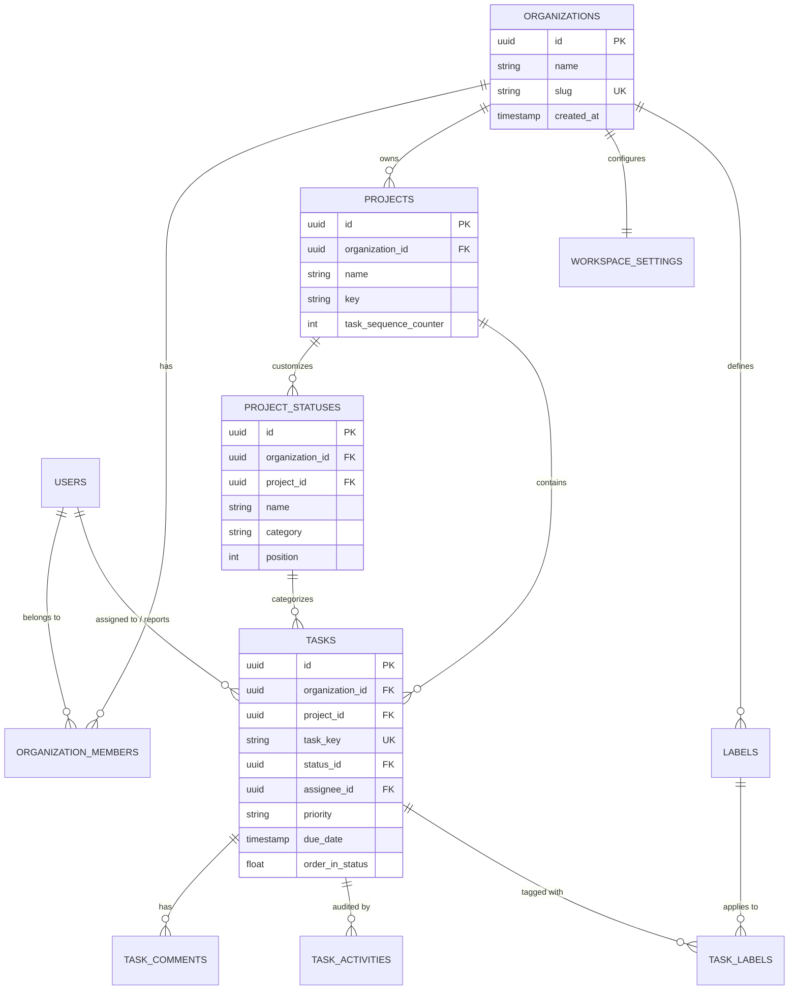

# Technical Documentation: Multi-Tenant Project Management Architecture

**Platform**: High-Performance Collaborative Project Management Platform (Linear/Jira architecture)  
**Document Version**: 1.0.0  
**Target Audience**: Staff/Principal Engineers, Security Architects, and Backend Engineering Teams  

---

## 1. Executive Summary & Design Rationale

Modern engineering teams expect instantaneous interactions (sub-100ms UI feedback), high concurrency, fine-grained access control, and complete data isolation. This document outlines the architectural rationale, relational data model, query patterns, indexing design, multi-tenant isolation, and schema evolution strategy for our enterprise project management platform.

### Core Architectural Drivers
1. **Multi-Tenancy with Strict Isolation**: Absolute cryptographic or logical isolation across organizations with zero cross-tenant leak vectors.
2. **Project-Level Flexibility**: Organizations define arbitrary projects with customized workflow statuses, distinct category semantics (`BACKLOG`, `UNSTARTED`, `IN_PROGRESS`, `COMPLETED`, `CANCELLED`), and fractional card ordering.
3. **Auditing & Change Data Capture**: Enterprise-grade compliance requiring an immutable append-only activity log for every mutation (status change, assignment, priority escalation).
4. **Sub-second Response Times at Scale**: Fast cursor-based pagination, deterministic keyset ordering, and targeted compound/partial indexing.

---

## 2. Entity Relationships & Data Model Rationale

### 2.1 Entity Relationship Diagram (ERD)



### 2.2 Normalization vs. Strategic Denormalization

| Entity / Field | Storage Strategy | Rationale & Trade-off Analysis |
| :--- | :--- | :--- |
| **`tasks.organization_id`** | Strategic Denormalization | Although `tasks` references `projects` (which has `organization_id`), storing `organization_id` directly on `tasks` avoids multi-table joins during tenant-scoped Row-Level Security checks and sharded queries. |
| **`tasks.task_key`** (e.g. `SEC-104`) | Atomic Trigger Generation | Generated via an atomic sequence counter per project (`projects.task_sequence_counter`) within a database transaction, avoiding distributed ID generator bottlenecks. |
| **`tasks.order_in_status`** | Fractional / Floating Point Indexing | Floating-point positioning allows inserting a task between two cards (`(pos_a + pos_b) / 2`) in \(O(1)\) without re-indexing hundreds of neighboring rows. An asynchronous rebalance job runs if precision degrades past 12 decimal places. |
| **`task_activities`** | Append-Only Normalized Event Store | Changes are recorded as discrete delta events (`field`, `old_value`, `new_value`, `metadata`) rather than diffing snapshots, enabling temporal replay, compliance export, and lightweight change logs. |

---

## 3. Query Patterns for High-Frequency Operations

### 3.1 Overdue Tasks Across Projects Assigned to Current User

A developer needs an aggregated view of all overdue work items across every project they are assigned to within their active organization.

#### Optimized SQL Query:
```sql
SELECT 
    t.id,
    t.task_key,
    t.title,
    t.priority,
    t.due_date,
    p.name AS project_name,
    ps.name AS status_name,
    ps.category AS status_category
FROM tasks t
JOIN projects p ON p.id = t.project_id
JOIN project_statuses ps ON ps.id = t.status_id
WHERE t.organization_id = '8f3e5c94-0a37-4d7a-8b1e-62d4e76a91c0'
  AND t.assignee_id = 'a12b3c4d-5e6f-7a8b-9c0d-1e2f3a4b5c6d'
  AND t.due_date < NOW()
  AND ps.category NOT IN ('COMPLETED', 'CANCELLED')
ORDER BY t.due_date ASC, t.id ASC
LIMIT 50;
```

#### Corresponding GraphQL Query:
```graphql
query GetMyOverdueTasks {
  myOverdueTasks(first: 50) {
    totalCount
    pageInfo {
      hasNextPage
      endCursor
    }
    edges {
      cursor
      node {
        id
        taskKey
        title
        priority
        dueDate
        project {
          name
        }
        status {
          name
          category
        }
      }
    }
  }
}
```

### 3.2 Kanban Column Task Loading with Keyset Pagination

Loading tasks in column view using deterministic cursor pagination:
```sql
-- Keyset cursor query: fetches the next 20 tasks after cursor ($cursor_created_at, $cursor_id)
SELECT id, task_key, title, priority, assignee_id, due_date, order_in_status, created_at
FROM tasks
WHERE project_id = $project_id
  AND status_id = $status_id
  AND (created_at, id) < ($cursor_created_at, $cursor_id)
ORDER BY created_at DESC, id DESC
LIMIT 20;
```

---

## 4. Indexing Strategy & Performance Considerations

To ensure query execution times remain below **15ms** even as tables scale to tens of millions of rows, the following indexing topology is deployed:

```
                                  INDEXING TOPOLOGY
┌─────────────────────────────────┬───────────────────────────────┬───────────────────────────────┐
│ Compound B-Tree Index           │ Target Query Pattern          │ Performance Optimization      │
├─────────────────────────────────┼───────────────────────────────┼───────────────────────────────┤
│ (project_id, status_id,         │ Kanban Board column queries   │ Direct index scan; eliminates │
│  order_in_status)               │ and drag-drop reordering      │ external sort operations      │
├─────────────────────────────────┼───────────────────────────────┼───────────────────────────────┤
│ (assignee_id, due_date)         │ "My Overdue Tasks" dashboard  │ Filters non-null dates;       │
│ WHERE due_date IS NOT NULL      │ across projects               │ 70% smaller index footprint   │
├─────────────────────────────────┼───────────────────────────────┼───────────────────────────────┤
│ (project_id, created_at DESC,   │ Deterministic cursor-based    │ Zero table re-scans; supports │
│  id DESC)                       │ keyset pagination             │ (created_at, id) composite    │
├─────────────────────────────────┼───────────────────────────────┼───────────────────────────────┤
│ GIN (to_tsvector('english',     │ Keyword title & description   │ Full-text inverted index;     │
│  title || ' ' || description))  │ search across backlog         │ sub-50ms search on 5M+ tasks  │
└─────────────────────────────────┴───────────────────────────────┴───────────────────────────────┘
```

### Keyset vs. Offset Pagination
Offset pagination (`OFFSET 10000 LIMIT 20`) causes the storage engine to scan and discard 10,000 index tuples, degrading linearly to seconds on deep pages. Our keyset index `(project_id, created_at DESC, id DESC)` guarantees \(O(\log N)\) b-tree seeks regardless of pagination depth.

---

## 5. Multi-Tenancy Isolation Architecture

We adopt a **Shared Database, Shared Schema with Discriminator + PostgreSQL Row-Level Security (RLS)** model. This delivers superior cost efficiency and operational agility compared to isolated schemas per tenant, while maintaining hardware-level guarantees via Postgres kernel RLS.

```
                          TENANT ISOLATION ARCHITECTURE
                      
    Client Request ──────► [GraphQL API Layer]
                                │
                                ▼
                       Extract & Verify JWT
                       (Claims: sub=user_id, org_id=tenant_id, role)
                                │
                                ▼
                       Database Connection Pool (PgBouncer)
                                │
                                ▼
                       Transaction Setup:
                       SET LOCAL app.current_tenant_id = 'org_uuid';
                       SET LOCAL app.current_user_id   = 'user_uuid';
                                │
                                ▼
                       PostgreSQL Engine Kernel
                       [ RLS Filter: organization_id = current_tenant_id ]
                                │
                                ▼
                       Table Rows (Zero cross-tenant leakage)
```

### Defense-in-Depth Mechanisms:
1. **Application-Layer Scoping**: Every GraphQL resolver automatically injects `organizationId` from authenticated context into query arguments.
2. **Database-Layer Enforcement**: Postgres RLS policies prevent accidental developer leaks (`SELECT * FROM tasks` automatically filters by `app.current_tenant_id`).
3. **Session Variable Protection**: Uses `SET LOCAL` so parameters are strictly bound to the active transaction and automatically wiped upon connection return to the pool.
4. **Role Hierarchy (RBAC)**:
   - **`OWNER`**: Billing, organization destruction, member promotion.
   - **`ADMIN`**: Project creation, status workflow modification, member management.
   - **`MEMBER`**: Task creation, assignment, comment editing, status transitions.
   - **`VIEWER`**: Read-only access to projects, tasks, and activity logs.

---

## 6. Zero-Downtime Migration Strategy

As a 24/7 mission-critical service, all database schema migrations follow the **Expand and Contract (Parallel Run)** methodology:

```
                            EXPAND AND CONTRACT LIFECYCLE
                            
    Phase 1: EXPAND        Phase 2: DUAL WRITE       Phase 3: BACKFILL       Phase 4: CONTRACT
   ┌────────────────┐     ┌──────────────────┐     ┌─────────────────┐     ┌─────────────────┐
   │ Add new column │ ──► │ App writes to    │ ──► │ Background job  │ ──► │ Deprecate & drop│
   │ as NULLABLE    │     │ both old & new   │     │ migrates legacy │     │ old column      │
   │ or new table   │     │ columns          │     │ records         │     │ cleanly         │
   └────────────────┘     └──────────────────┘     └─────────────────┘     └─────────────────┘
```

### Concrete Migration Directives:
1. **No Table Locks on Heavy Operations**:
   - Indexes are created concurrently: `CREATE INDEX CONCURRENTLY idx_...`.
   - Never use `NOT NULL` without a default on large existing tables in a single transaction; use `ADD CONSTRAINT ... NOT VALID` followed by `VALIDATE CONSTRAINT` asynchronously.
2. **Safe Column Renames**:
   - Add new column \(\rightarrow\) Dual-write via API/triggers \(\rightarrow\) Backfill old records \(\rightarrow\) Switch readers to new column \(\rightarrow\) Drop old column.
3. **Automated Rollback Readiness**:
   - Every migration tool run (`Prisma Migrate` / `Flyway` / `golang-migrate`) maintains an exact, verified rollback script.
